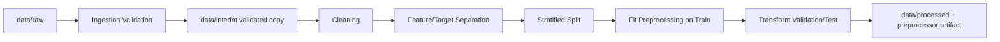

# Customer Churn Prediction & Retention Decision Intelligence Platform

Production-style analytics platform scaffold for churn prediction, explainability, segmentation, revenue simulation, retention recommendations, and Streamlit dashboarding.

This repository currently contains the project structure only. Business logic, model training, feature engineering, and dashboard implementation are intentionally not implemented yet.

## Project Scope

The platform will use the IBM Telco Customer Churn dataset exclusively and will follow the architecture defined in:

- `outputs/customer_churn_platform_implementation_roadmap.md`

## Repository Layout

```text
config/                 Configuration files
data/                   Raw, interim, processed, and external data folders
artifacts/              Persisted models, preprocessors, metrics, and explainability outputs
notebooks/              Exploratory notebooks, if used later
reports/                Figures, model cards, and business insight artifacts
src/churn_platform/     Main Python package
app/                    Streamlit application shell
tests/                  Test suite placeholders
docs/                   Project documentation
outputs/                User-facing planning deliverables
```

## Environment Setup

Recommended local setup:

```bash
python -m venv .venv
.venv\\Scripts\\activate
python -m pip install --upgrade pip
pip install -r requirements.txt
```

On macOS/Linux:

```bash
python -m venv .venv
source .venv/bin/activate
python -m pip install --upgrade pip
pip install -r requirements.txt
```

## Current Status

- Git repository initialized.
- Project folder structure created.
- Dependency manifest created.
- Configuration placeholders created.
- Python package placeholders created.
- Streamlit app placeholders created.
- Test and documentation placeholders created.
- Data ingestion and validation modules created.

## Data Pipeline

Raw IBM Telco Customer Churn files belong in `data/raw/`. The active raw dataset path is configured in `config/config.yaml` under `paths.raw_dataset_file`, so the ingestion code does not depend on hardcoded absolute paths.

The ingestion pipeline loads the raw file, validates it against the reusable schema in `src/churn_platform/data/schema.py`, writes structured validation results to `reports/validation_results.json`, writes a text-only data profile to `reports/data_profile.md`, and refreshes the data dictionary in `docs/data_dictionary.md`.

Validation checks include file loading, row and column counts, required and unexpected columns, duplicate rows, duplicate `CustomerID` values, missing values, empty strings, datatype consistency, unexpected categorical values, and invalid numerical ranges.

When validation passes, the raw file is copied unchanged into `data/interim/`. Future preprocessing modules should consume this validated interim copy instead of reading directly from `data/raw/`. This keeps raw data immutable while giving downstream modules a trusted ingestion boundary.

Run the ingestion pipeline from the project root:

```bash
python -m churn_platform.data.ingestion --config config/config.yaml
```

If the package has not been installed in editable mode, set `PYTHONPATH=src` before running the command.

## Preprocessing Pipeline

The preprocessing pipeline consumes the validated interim dataset from `data/interim/` and produces machine-learning-ready train, validation, and test arrays in `data/processed/`. Configuration lives in `config/preprocessing_config.yaml`.

Run preprocessing from the project root:

```bash
python -m churn_platform.preprocessing.pipeline --config config/preprocessing_config.yaml
```

The pipeline performs whitespace trimming, empty-string normalization, `Total Charges` numeric conversion, missing-value handling, target conversion, leakage/identifier/reporting column removal, automatic categorical encoding with `OneHotEncoder(handle_unknown="ignore")`, optional numerical scaling with `StandardScaler`, and stratified 70/15/15 splitting.

## Feature Selection

Feature selection is configuration-driven. The selected target is `Churn Label`, mapped to binary labels where `Yes = 1` and `No = 0`. Identifier columns, duplicate target columns, post-event leakage columns, and reporting-only columns are separated from model features before encoding and scaling.

Removed by default:

- Identifier: `CustomerID`
- Leakage or duplicate target: `Churn Value`, `Churn Score`, `Churn Reason`, `Churn Category`, `Customer Status`
- Reporting-only: `Count`, `Country`, `State`, `Lat Long`
- Target as feature: `Churn Label`

## Data Flow



## Next Implementation Phase

The next phase should implement dataset ingestion and validation only, following the milestone roadmap. Business logic should remain separated from machine learning logic and dashboard logic.
