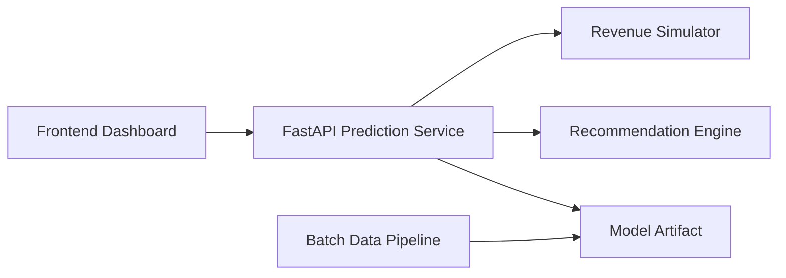

# Customer Churn Prediction & Retention Decision Intelligence Platform

## 1. Executive Summary

### Project Goal

Build a production-style internal analytics platform for a SaaS or telecom business that predicts customer churn, explains churn drivers, estimates financial exposure, segments customers into actionable personas, simulates retention campaigns, and recommends retention actions through an interactive Streamlit dashboard.

This is not a standalone churn classifier. It is a decision intelligence platform that connects machine learning outputs to business actions.

### Intended Audience

| Audience | Primary Need |
|---|---|
| Executives | Understand churn risk, revenue exposure, and retention ROI |
| Marketing | Prioritize campaign audiences and tailor offers |
| Customer Success | Identify customers needing intervention and understand why |
| Sales | Protect high-value accounts and renewal opportunities |
| Product | Identify service gaps, friction patterns, and subscription risks |
| Data Team | Maintain reproducible pipelines, models, and analytics assets |
| Operations | Plan campaign workload, contact volume, and process execution |

### Business Value

The platform should help the business:

- Reduce preventable churn by identifying customers at risk before cancellation.
- Prioritize high-value customers where intervention has the greatest financial return.
- Explain why customers are likely to churn in business language.
- Estimate projected churn loss and savings from retention campaigns.
- Support targeted retention strategies instead of blanket discounting.
- Convert raw customer data into executive-ready insights.

### Technical Value

The project demonstrates:

- End-to-end machine learning workflow design.
- Explainable AI with global and local explanations.
- Modular software architecture.
- Data validation and reproducible preprocessing.
- Business analytics and financial simulation.
- Streamlit dashboard product design.
- Deployment-ready project organization.

### Final Deliverables

- Clean, modular Python project.
- Reproducible data preprocessing pipeline.
- Trained churn prediction model.
- Explainability module using SHAP.
- Customer segmentation module.
- Revenue impact simulator.
- Rule-based retention recommendation engine.
- Interactive Streamlit dashboard.
- Project documentation, screenshots, reports, and resume positioning material.

---

## 2. Business Context

### What Customer Churn Means

Customer churn occurs when a customer stops doing business with the company. In telecom, churn may mean canceling wireless, internet, phone, or bundled services. In SaaS, churn may mean canceling a subscription, failing to renew, downgrading, or becoming inactive.

The IBM Telco dataset represents churn as a labeled customer outcome through `Churn Label` and `Churn Value`.

### Why Churn Matters

Acquiring a new customer is usually more expensive than retaining an existing one. Churn directly affects:

- Recurring revenue.
- Customer lifetime value.
- Marketing efficiency.
- Sales productivity.
- Brand reputation.
- Product-market fit signals.

Example: If 2,000 customers each pay $75 monthly and 20% are likely to churn, the monthly revenue at risk is:

`2,000 x 20% x $75 = $30,000 monthly revenue at risk`

Annualized, this becomes:

`$30,000 x 12 = $360,000 annual revenue at risk`

### Customer Lifetime Value

Customer lifetime value, represented in the dataset by `CLTV`, estimates the total future value of a customer relationship. Retaining a high-CLTV customer is usually more valuable than retaining a low-CLTV customer, even if both have the same churn probability.

### Retention Economics

Retention should be evaluated with expected value:

`Expected Retention Value = Revenue at Risk x Campaign Success Rate - Campaign Cost`

Example:

- Customer monthly charge: $90
- Estimated remaining value: $1,800
- Churn probability: 70%
- Revenue at risk: `$1,800 x 0.70 = $1,260`
- Retention offer cost: $100
- Expected success rate: 25%
- Expected saved revenue: `$1,260 x 0.25 = $315`
- Net expected gain: `$315 - $100 = $215`

### Executive KPIs

| KPI | Meaning | Why It Matters |
|---|---|---|
| Churn rate | Percentage of customers who churn | Measures customer loss |
| Predicted churn rate | Percentage of customers predicted at risk | Forward-looking risk signal |
| Revenue at risk | Estimated revenue exposed to churn | Quantifies financial exposure |
| High-risk high-value customers | Customers with high churn probability and high CLTV | Priority intervention group |
| Retention ROI | Expected campaign return after costs | Guides budget allocation |
| False negative cost | Value lost from missed churners | Drives recall-oriented modeling |
| Customer segment churn rate | Churn rate by persona | Supports targeted strategy |
| Contract churn concentration | Churn by contract type | Reveals structural retention issues |

---

## 3. Stakeholders

| Stakeholder | Platform Usage |
|---|---|
| Executive Management | Reviews churn KPIs, revenue exposure, campaign ROI, and strategic risk areas |
| Marketing Team | Builds targeted campaigns by segment, churn probability, customer value, and churn reason |
| Customer Success | Prioritizes outreach queues and uses customer-level explanations before contacting accounts |
| Sales | Identifies high-value renewal risks and expansion accounts needing proactive attention |
| Product Team | Studies churn drivers related to service adoption, support, internet service, and contract patterns |
| Data Team | Maintains pipelines, monitors performance, validates assumptions, and retrains models |
| Operations | Plans retention capacity, campaign volume, contact routing, and service recovery workflows |

---

## 4. Functional Requirements

### Data Management

| Feature | Description | Business Rationale |
|---|---|---|
| Dataset loading | Load the IBM Telco Customer Churn dataset from a configured local path | Ensures reproducibility |
| Schema validation | Verify expected columns, datatypes, and allowed values | Prevents silent data quality failures |
| Missing value handling | Detect and resolve missing or malformed values | Protects model quality |
| Duplicate handling | Identify duplicate customer IDs and duplicate rows | Preserves customer-level integrity |
| Data dictionary | Maintain definitions for each dataset field | Enables shared business understanding |
| Train-ready dataset creation | Produce leakage-safe training features | Prevents inflated model performance |

### Machine Learning

| Feature | Description | Business Rationale |
|---|---|---|
| Churn prediction | Predict probability of churn for each customer | Enables proactive retention |
| Risk banding | Classify customers into Low, Medium, High, Critical risk | Makes model output actionable |
| Batch scoring | Score all customers in the dataset | Supports campaign planning |
| Customer lookup | Search a customer by ID and view prediction details | Supports account-level intervention |
| Threshold tuning | Adjust operating threshold based on business priorities | Aligns model behavior to cost tradeoffs |
| Model comparison | Compare Logistic Regression, tree models, and boosting models | Demonstrates disciplined model selection |

### Explainability

| Feature | Description | Business Rationale |
|---|---|---|
| Global feature importance | Show top churn drivers across all customers | Supports executive and product insight |
| Local explanations | Explain individual customer risk | Supports customer success action |
| SHAP summaries | Visualize direction and magnitude of drivers | Builds trust in predictions |
| Business translations | Convert model features into plain-language reasons | Makes ML usable by non-technical teams |

### Segmentation

| Feature | Description | Business Rationale |
|---|---|---|
| Customer clustering | Segment customers by behavior, value, services, and contract profile | Enables differentiated retention |
| Persona labeling | Translate clusters into business personas | Makes segments memorable and actionable |
| Segment KPIs | Churn rate, CLTV, monthly charges, tenure, and service adoption by segment | Prioritizes segments |
| Segment visualization | Scatterplots, profiles, radar charts, and distribution charts | Reveals patterns quickly |

### Financial Simulation

| Feature | Description | Business Rationale |
|---|---|---|
| Revenue at risk | Estimate revenue exposed to churn | Quantifies financial impact |
| Campaign cost modeling | Estimate intervention cost by customer group | Supports budget decisions |
| Retention success assumptions | Configure expected campaign conversion rates | Enables scenario planning |
| ROI calculation | Estimate net gain from campaign | Prioritizes profitable interventions |
| Sensitivity analysis | Test different assumptions for success rate and cost | Shows uncertainty and risk |

### Recommendation Engine

| Feature | Description | Business Rationale |
|---|---|---|
| Rule-based offers | Recommend discounts, service fixes, contract nudges, or support outreach | Connects insight to action |
| Prioritization score | Rank customers by churn risk, value, and expected ROI | Focuses limited resources |
| Explainable rule output | Show why a recommendation was selected | Builds stakeholder trust |
| Offer category mapping | Map customer profile to retention strategy | Reduces blanket discounting |

### Dashboard and Reporting

| Feature | Description | Business Rationale |
|---|---|---|
| Executive dashboard | High-level KPIs, trends, and revenue risk | Supports leadership decisions |
| Customer explorer | Filter and inspect customer records | Supports operational analysis |
| Prediction page | Score customers and inspect risk bands | Operationalizes ML |
| Explainability page | Show global and local explanations | Builds trust |
| Segmentation page | Explore personas and segment performance | Supports strategy |
| Revenue simulator | Configure assumptions and estimate ROI | Supports financial planning |
| Business insights page | Curated narrative insights | Supports storytelling |
| Report export | Export filtered tables and summary reports | Enables offline sharing |

---

## 5. Non-Functional Requirements

| Requirement | Specification |
|---|---|
| Maintainability | Code must be modular, documented, typed where practical, and separated by responsibility |
| Scalability | Architecture should support larger datasets and future batch scoring without restructuring |
| Usability | Dashboard should support non-technical users with clear labels, filters, and explanations |
| Reproducibility | Data splits, preprocessing, model training, and outputs must be deterministic using configured seeds |
| Security | No secrets committed; environment variables used for deployment settings |
| Modularity | Data, features, models, explainability, simulation, recommendations, and UI must be separate modules |
| Portability | Project should run locally, in Docker, and on Streamlit Community Cloud |
| Performance | Dashboard pages should load quickly using cached data and model artifacts |
| Documentation | README, architecture guide, dataset notes, and user guide required |
| Code quality | Linting, formatting, tests, and consistent naming conventions required |
| Deployment readiness | App entry point, dependency file, model artifacts, and configuration must be deployment compatible |

---

## 6. Dataset Understanding

Dataset: IBM Telco Customer Churn Dataset  
Source: Kaggle, `yeanzc/telco-customer-churn-ibm-dataset`

The dataset is assumed to remain unchanged. Architectural decisions should be based on the known IBM Telco schema.

### Column-Level Data Dictionary

| Column | Meaning | Datatype | Category | Business Relevance | Use for ML | Leakage Risk | Preprocessing |
|---|---|---:|---|---|---|---|---|
| `CustomerID` | Unique customer identifier | string | Identifier | Needed for lookup/reporting | No | No | Preserve for joins only |
| `Count` | Row count helper, usually 1 | integer | Reporting-only | Useful for aggregation checks | No | No | Remove from training |
| `Country` | Customer country | category | Geography | Usually constant in this dataset | No | No | Drop if single value |
| `State` | Customer state | category | Geography | Usually California only | No | No | Drop if single value |
| `City` | Customer city | category | Geography | Supports local churn analysis | Optional | No | Encode only if stable; otherwise reporting |
| `Zip Code` | Customer ZIP code | string/integer | Geography | Local market indicator | Optional | No | Treat as categorical or reporting-only |
| `Lat Long` | Combined latitude/longitude text | string | Geography | Supports mapping | No | No | Use only for reporting |
| `Latitude` | Latitude coordinate | float | Geography | Supports map visualization | Optional | No | Validate numeric range |
| `Longitude` | Longitude coordinate | float | Geography | Supports map visualization | Optional | No | Validate numeric range |
| `Gender` | Customer gender | category | Demographic | May show demographic differences | Yes | No | One-hot encode |
| `Senior Citizen` | Whether customer is senior | category/binary | Demographic | Important risk and support dimension | Yes | No | Convert to binary |
| `Partner` | Whether customer has partner | category | Household | Household stability signal | Yes | No | One-hot/binary encode |
| `Dependents` | Whether customer has dependents | category | Household | Household profile and price sensitivity | Yes | No | One-hot/binary encode |
| `Tenure Months` | Months as customer | integer | Relationship | Strong churn predictor and CLTV input | Yes | No | Scale or bucket |
| `Phone Service` | Whether phone service is active | category | Service | Product adoption signal | Yes | No | One-hot/binary encode |
| `Multiple Lines` | Multiple phone lines status | category | Service | Service depth and value signal | Yes | No | One-hot encode |
| `Internet Service` | DSL, Fiber optic, or None | category | Service | Major churn driver in telco | Yes | No | One-hot encode |
| `Online Security` | Online security subscription | category | Add-on service | Product stickiness signal | Yes | No | One-hot encode |
| `Online Backup` | Online backup subscription | category | Add-on service | Product stickiness signal | Yes | No | One-hot encode |
| `Device Protection` | Device protection subscription | category | Add-on service | Product stickiness signal | Yes | No | One-hot encode |
| `Tech Support` | Tech support subscription | category | Add-on service | Support dependency/stickiness signal | Yes | No | One-hot encode |
| `Streaming TV` | Streaming TV subscription | category | Add-on service | Entertainment bundle signal | Yes | No | One-hot encode |
| `Streaming Movies` | Streaming movies subscription | category | Add-on service | Entertainment bundle signal | Yes | No | One-hot encode |
| `Contract` | Month-to-month, one year, two year | category | Commercial | Critical retention factor | Yes | No | Ordinal or one-hot encode |
| `Paperless Billing` | Whether billing is paperless | category | Billing | Digital behavior and billing friction | Yes | No | Binary encode |
| `Payment Method` | Payment channel | category | Billing | Autopay and friction signal | Yes | No | One-hot encode |
| `Monthly Charges` | Current monthly bill | float | Financial | Revenue, affordability, price sensitivity | Yes | No | Scale; validate non-negative |
| `Total Charges` | Cumulative charges | float/string | Financial | Proxy for historic value | Yes | No | Convert to numeric; handle blanks |
| `Churn Label` | Yes/No churn target | category | Target | Human-readable churn outcome | No as feature | Direct target | Use as target or display |
| `Churn Value` | 1/0 churn target | integer | Target | Model target | Target only | Direct target | Use as `y`; remove from features |
| `Churn Score` | IBM-generated churn score | integer | Post-event/derived | Existing model-like score | No | High leakage | Remove from training |
| `CLTV` | Customer lifetime value estimate | integer/float | Financial derived | Value prioritization and ROI | Optional | Possible leakage depending generation | Prefer reporting/simulation; exclude baseline ML |
| `Churn Reason` | Reason customer churned | category/text | Post-event | Useful for churned-customer analysis | No | Severe leakage | Remove from training |

### Column Categories

| Category | Columns |
|---|---|
| Identifier | `CustomerID` |
| Reporting-only | `Count`, `Country`, `State`, `Lat Long` |
| Geographic | `City`, `Zip Code`, `Latitude`, `Longitude` |
| Demographic | `Gender`, `Senior Citizen`, `Partner`, `Dependents` |
| Service behavior | `Phone Service`, `Multiple Lines`, `Internet Service`, service add-ons |
| Commercial | `Contract`, `Monthly Charges`, `Total Charges` |
| Billing | `Paperless Billing`, `Payment Method` |
| Targets | `Churn Label`, `Churn Value` |
| Leakage/post-event | `Churn Score`, `Churn Reason` |
| Value analytics | `CLTV` |

### Features to Remove Before Training

Remove these columns from model features:

| Column | Reason |
|---|---|
| `CustomerID` | Identifier; no predictive meaning and risks memorization |
| `Count` | Constant aggregation helper |
| `Country` | Expected to be constant; no model value |
| `State` | Expected to be constant; no model value |
| `Lat Long` | Redundant text representation of coordinates |
| `Churn Label` | Direct target leakage |
| `Churn Value` | Target variable; use only as `y` |
| `Churn Score` | Existing churn score; model-derived leakage |
| `Churn Reason` | Known only after churn; severe post-event leakage |

Recommended conservative approach:

- Exclude `CLTV` from the baseline predictive model because it may be generated using customer survival/value assumptions not transparent in the dataset.
- Use `CLTV` for financial prioritization, segmentation, and revenue simulation.
- Optionally run a separate experiment including `CLTV`, clearly labeled as a business-value-enhanced model, not the primary leakage-safe benchmark.

---

## 7. Data Pipeline

### Pipeline Overview

```mermaid
flowchart LR
    A["Raw IBM Telco Dataset"] --> B["Schema Validation"]
    B --> C["Data Cleaning"]
    C --> D["Leakage Column Removal"]
    D --> E["Feature Engineering"]
    E --> F["Train/Validation/Test Split"]
    F --> G["Preprocessing Pipeline"]
    G --> H["Model Training"]
    H --> I["Evaluation"]
    I --> J["Persisted Artifacts"]
    J --> K["Dashboard Scoring"]
```



### Loading

- Read the dataset from a configured path.
- Support `.csv` and `.xlsx` if the source file format differs.
- Validate that the file contains the expected IBM Telco schema.
- Fail clearly if required columns are missing.

### Validation

Validate:

- Required columns are present.
- `CustomerID` is unique.
- `Churn Value` contains only `0` and `1`.
- `Monthly Charges`, `Total Charges`, `Tenure Months`, and `CLTV` are numeric after cleaning.
- Latitude and longitude are within valid ranges.
- Categorical values match expected domains.
- No duplicated customer rows exist.

### Missing Values

Expected issue:

- `Total Charges` may appear as blank or text for customers with zero tenure.

Handling:

- Convert `Total Charges` to numeric.
- For blank values, impute `0` when `Tenure Months = 0`; otherwise impute using median or flag for inspection.
- Add a missingness indicator only if missingness is meaningful.

### Duplicates

- Drop exact duplicate rows after logging count.
- If duplicate `CustomerID` values exist with conflicting fields, block the pipeline and require investigation.

### Encoding

- Binary categorical fields: map Yes/No-like values to 1/0 where appropriate.
- Multi-class categorical fields: one-hot encode using `handle_unknown='ignore'`.
- High-cardinality geography: use carefully.
  - For business reporting, keep raw `City` and `Zip Code`.
  - For ML, either exclude or use target-safe grouping such as region buckets if justified.

### Scaling

- Scale numeric features for Logistic Regression and clustering.
- Tree-based models do not require scaling, but a unified preprocessing pipeline should still produce stable numeric matrices.
- Maintain separate preprocessing pipelines for:
  - Predictive modeling.
  - Clustering.
  - Dashboard reporting.

### Train/Validation/Test Split

Recommended split:

- Train: 60%
- Validation: 20%
- Test: 20%

Requirements:

- Stratify by `Churn Value`.
- Use a fixed random seed.
- Keep the test set untouched until final model evaluation.
- Persist split indices or customer IDs for reproducibility.

### Feature Selection

Approach:

1. Start with leakage-safe domain-approved features.
2. Remove constants and near-constants.
3. Inspect multicollinearity for linear models.
4. Compare performance with and without geography.
5. Validate feature set through SHAP and business review.

### Pipeline Persistence

Persist:

- Preprocessing transformer.
- Model artifact.
- Feature list.
- Label mappings.
- Training metadata.
- Evaluation metrics.
- Model version.
- Threshold configuration.

Recommended persistence:

- `joblib` for scikit-learn pipelines and model artifacts.
- JSON or YAML for metadata and configuration.

---

## 8. Exploratory Data Analysis

EDA should be business-first: every chart must answer a stakeholder question.

| Chart | Purpose | Business Insight | Expected Interpretation | Potential Action |
|---|---|---|---|---|
| Overall churn rate KPI | Establish baseline churn | How large is the problem? | High churn indicates retention urgency | Set retention targets |
| Churn count bar chart | Show churned vs retained volume | Scale of churn population | Imbalanced class likely | Use proper metrics |
| Churn by contract type | Compare churn across contract lengths | Contract structure risk | Month-to-month likely higher churn | Promote annual contracts |
| Churn by tenure bucket | Identify lifecycle risk | New vs mature customer risk | Early-tenure churn may spike | Improve onboarding |
| Monthly charges distribution by churn | Analyze price sensitivity | Whether churners pay more | Higher charges may increase risk | Offer targeted discounts |
| Total charges by churn | Understand historical value | Mature customers may have high accumulated spend | Low total charges may reflect new churn | Segment by lifecycle |
| CLTV distribution by churn | Prioritize value at risk | High-value churn exposure | High CLTV churners are urgent | Create VIP retention queue |
| Churn by internet service | Identify service-specific risk | Fiber/DSL differences | Fiber may show higher churn due to price/support | Investigate service quality |
| Churn by payment method | Analyze billing friction | Manual payment may correlate with churn | Electronic check often higher risk | Encourage autopay |
| Churn by paperless billing | Evaluate digital billing pattern | Billing behavior signal | Paperless may correlate with certain segments | Pair with payment analysis |
| Churn by tech support | Assess support impact | Lack of support may raise churn | Customers without support may be vulnerable | Bundle support |
| Churn by online security | Assess add-on stickiness | Add-ons can reduce churn | Security subscribers may be stickier | Cross-sell add-ons |
| Service count vs churn | Measure bundle depth | More services may improve retention | Low service count may mean weak relationship | Bundle offers |
| Geographic churn map | Identify local market issues | City/ZIP churn concentration | Local churn clusters may reveal operations issues | Regional campaigns |
| Correlation heatmap | Detect relationships among numeric variables | Understand numeric dependencies | Tenure and total charges likely correlated | Avoid redundant interpretation |
| Segment profile chart | Compare personas | Which personas churn most? | Certain personas show concentrated risk | Persona-specific actions |
| Churn reason chart | Explain actual churn causes among churned customers | Why customers left | Competitor, price, dissatisfaction may dominate | Align retention offers |
| Customer status summary | Understand current customer lifecycle | Active vs churned state | Helps reporting narrative | Executive summary |
| Charges by contract boxplot | Connect price and contract | Whether high charges concentrate in risky contracts | Month-to-month high-charge customers may be critical | Discount or contract migration |
| Tenure vs monthly charges scatter | Identify risk quadrants | New expensive customers may churn | High charge and low tenure is risky | Onboarding and price reassurance |

---

## 9. Feature Engineering

| Feature | Formula / Definition | Business Reasoning | Predictive Value | Complexity |
|---|---|---|---|---|
| `tenure_bucket` | Bucket `Tenure Months` into 0-6, 7-12, 13-24, 25-48, 49+ | Customer lifecycle stages behave differently | High | Low |
| `is_new_customer` | `Tenure Months <= 6` | New customers often churn during onboarding | High | Low |
| `is_long_term_customer` | `Tenure Months >= 48` | Long tenure suggests loyalty | Medium | Low |
| `service_count` | Count active services/add-ons | More services indicate stickiness | High | Medium |
| `has_streaming_bundle` | Streaming TV and/or Streaming Movies | Entertainment bundles may increase engagement | Medium | Low |
| `has_security_bundle` | Online Security or Device Protection or Online Backup | Protective add-ons imply higher dependency | Medium | Low |
| `support_dependency` | Tech Support = Yes | Support users may value service assurance | Medium | Low |
| `no_support_risk` | Internet Service active and Tech Support = No | Internet users without support may churn after issues | High | Low |
| `premium_customer` | Monthly Charges above 75th percentile | High spend customers have larger revenue impact | Medium | Low |
| `low_value_customer` | Monthly Charges below 25th percentile and low CLTV | Lower financial priority | Medium | Low |
| `average_monthly_spend` | `Total Charges / max(Tenure Months, 1)` | Normalized spend history | Medium | Low |
| `charge_gap` | `Monthly Charges - average_monthly_spend` | Detect recent price increase proxy | Medium | Medium |
| `estimated_annual_revenue` | `Monthly Charges * 12` | Business-friendly revenue exposure | High for simulation | Low |
| `revenue_at_risk_raw` | `Monthly Charges * predicted_churn_probability * 12` | Prioritizes risk financially | Dashboard only | Low |
| `month_to_month_flag` | Contract = Month-to-month | Flexible contracts have higher churn risk | High | Low |
| `contract_commitment_score` | Month-to-month=0, One year=1, Two year=2 | Measures commercial lock-in | High | Low |
| `autopay_flag` | Payment method contains automatic | Autopay reduces payment friction | Medium | Low |
| `manual_payment_risk` | Electronic check or mailed check | Manual payment may signal churn risk | Medium | Low |
| `digital_engagement` | Paperless Billing + autopay + online services | Measures digital adoption | Medium | Medium |
| `household_stability_score` | Partner + Dependents | Household ties may reduce churn | Medium | Low |
| `senior_without_support` | Senior Citizen and Tech Support = No | Potential support gap | Medium | Low |
| `fiber_high_charge_risk` | Fiber optic and Monthly Charges above median | Price/service risk combination | High | Low |
| `single_service_customer` | Service count <= 1 | Weak product relationship | Medium | Low |
| `bundle_depth_score` | Count of Phone, Internet, Streaming, Security, Backup, Support | Deeper product usage implies retention | High | Medium |
| `price_sensitivity_proxy` | Month-to-month and high Monthly Charges and no add-ons | High bill with low perceived value | High | Medium |
| `geo_market` | City or ZIP-derived grouping | Local market churn concentration | Optional | Medium |
| `cltv_tier` | CLTV quartile | Prioritization and segmentation | High for business | Low |
| `risk_value_quadrant` | Churn probability band x CLTV tier | Retention prioritization | Dashboard only | Low |

Important rule:

- Features using predicted churn probability must never be used during model training. They are post-model decision features for ranking, simulation, and dashboarding.

---

## 10. Machine Learning Strategy

### Modeling Stages

| Stage | Model | Purpose |
|---|---|---|
| Baseline | Logistic Regression | Establish interpretable benchmark |
| Intermediate | Random Forest or XGBoost | Capture nonlinear relationships |
| Production | CatBoost or XGBoost, selected by validation performance and explainability | Strong predictive performance with manageable deployment |

### Model Comparison

| Model | Advantages | Limitations | Training Speed | Interpretability | Deployment Suitability | Business Suitability |
|---|---|---|---|---|---|---|
| Logistic Regression | Simple, fast, explainable, calibrated with care | Linear assumptions, weaker interactions | Very fast | High | Excellent | Strong baseline for trust |
| Decision Tree | Easy to explain visually | Overfits easily | Fast | Medium-high | Good | Useful for rules, weak as final model |
| Random Forest | Robust, handles nonlinear patterns | Less interpretable, larger artifacts | Medium | Medium | Good | Good operational model |
| XGBoost | Strong performance, handles complex interactions | Requires tuning, extra dependency | Medium | Medium with SHAP | Good | Excellent if tuned |
| LightGBM | Fast and high-performing | Can be sensitive on small data; extra dependency | Fast | Medium with SHAP | Good | Good alternative |
| CatBoost | Strong categorical handling, often less preprocessing | Extra dependency, slightly heavier | Medium | Medium with SHAP | Good | Excellent for tabular categorical data |

### Recommended Production Model

Recommended final model: **XGBoost classifier**.

Rationale:

- Strong tabular performance.
- Mature ecosystem.
- Works well with SHAP.
- Familiar to recruiters and engineering teams.
- Easier to deploy in a Streamlit portfolio project than a more specialized production stack.
- Handles nonlinear interactions between contract, tenure, charges, payment method, and service subscriptions.

Secondary recommendation:

- Include Logistic Regression as the explainable benchmark.
- Include Random Forest as a robust non-boosted comparison.
- Optionally include CatBoost as an advanced comparison if categorical preprocessing complexity becomes a learning objective.

---

## 11. Model Evaluation

### Metrics

| Metric | Meaning | Use |
|---|---|---|
| Accuracy | Overall correct predictions | Secondary only; can mislead with imbalance |
| Precision | Of predicted churners, how many truly churned | Controls wasted retention spend |
| Recall | Of true churners, how many were found | Controls missed churn risk |
| F1 | Balance of precision and recall | Useful summary metric |
| ROC-AUC | Ranking quality across thresholds | Good general discrimination metric |
| PR-AUC | Precision-recall quality under imbalance | Better when churn class is minority |
| Confusion Matrix | Counts TP, FP, TN, FN | Enables business cost analysis |
| Calibration | Whether probabilities match actual frequencies | Critical for revenue simulation |

### Business Cost Interpretation

| Error Type | Business Meaning | Cost |
|---|---|---|
| False Positive | Customer predicted to churn but would have stayed | Wasted retention offer, margin loss, possible discount leakage |
| False Negative | Customer predicted safe but actually churns | Lost revenue, lost CLTV, avoidable churn |

In churn retention, false negatives are usually more expensive than false positives, especially for high-CLTV customers. Therefore, deployment should prioritize recall while maintaining acceptable precision.

### Recommended Deployment Metric

Primary deployment driver:

- **Recall at a business-approved precision floor**.

Example:

- Choose a threshold that captures at least 75% of churners while keeping precision above 45%.

Secondary metrics:

- PR-AUC for imbalanced classification.
- Calibration error for financial simulations.
- Revenue-weighted recall for high-value customers.

### Threshold Tuning

Threshold should be tuned by expected value, not default `0.50`.

Decision score:

`Expected Value = Churn Probability x Revenue at Risk x Retention Success Rate - Intervention Cost`

The campaign should prioritize customers where expected value is positive and operational capacity is available.

---

## 12. Explainable AI

### Explainability Module Goals

The explainability module should translate model behavior into business language for different audiences.

### Global Explanations

Outputs:

- Top global churn drivers.
- SHAP summary plot.
- SHAP bar chart.
- Feature dependence plots for major drivers.
- Business narrative describing why each feature matters.

Expected examples:

- Month-to-month contracts increase churn risk.
- Short tenure increases churn risk.
- High monthly charges increase churn risk for some segments.
- Lack of tech support may increase churn risk among internet customers.

### Local Explanations

For a selected customer, display:

- Churn probability.
- Risk band.
- Top positive churn drivers.
- Top negative churn drivers.
- Plain-language explanation.
- Recommended action.

Example translation:

| Technical Feature | Business Translation |
|---|---|
| `Contract_Month-to-month` | Customer has no long-term commitment |
| `Tenure Months` low | Customer is still early in lifecycle |
| `Monthly Charges` high | Customer may be price sensitive |
| `Tech Support_No` | Customer lacks service support coverage |

### Audience-Specific Outputs

| Audience | Explanation Style |
|---|---|
| Executives | Top drivers, revenue exposure, strategic themes |
| Marketing | Campaign segments and offer rationale |
| Customer Success | Customer-specific talking points |
| Product | Service and feature adoption patterns |
| Data Team | SHAP values, dependence plots, model diagnostics |

---

## 13. Customer Segmentation

### Recommended Algorithm

Primary approach: **K-Means clustering on scaled behavioral, financial, and service features**.

Rationale:

- Easy to explain.
- Works well for portfolio projects.
- Produces clear cluster labels.
- Supports dashboard visualization.

Alternative:

- Hierarchical clustering for interpretability.
- Gaussian Mixture Models if soft segment assignment is desired.

### Segmentation Features

Use:

- `Tenure Months`
- `Monthly Charges`
- `Total Charges`
- `CLTV`
- `service_count`
- `contract_commitment_score`
- `autopay_flag`
- `digital_engagement`
- `household_stability_score`
- `support_dependency`

Do not use target columns directly for clustering. Churn rate should be calculated after clusters are assigned.

### Validation

Use:

- Elbow method.
- Silhouette score.
- Cluster size sanity checks.
- Business interpretability review.

### Visualizations

- 2D PCA scatterplot colored by segment.
- Segment KPI table.
- Segment churn rate bar chart.
- Radar chart of segment profiles.
- Monthly charges vs tenure scatter by segment.
- CLTV vs churn probability by segment.

### Business Personas

| Persona | Likely Profile | Business Action |
|---|---|---|
| Loyal Long-Term Customers | High tenure, stable contract, multiple services | Protect relationship, upsell carefully |
| High-Value At-Risk Customers | High CLTV, high monthly charges, high churn probability | Priority retention outreach |
| Price-Sensitive Month-to-Month Customers | Flexible contract, high charges, low add-on depth | Offer discount or contract incentive |
| New Customer Onboarding Risk | Low tenure, limited service usage | Improve onboarding and early support |
| Digital Autopay Stable Customers | Autopay, paperless, bundled services | Low-touch retention |
| Support-Vulnerable Internet Customers | Internet service, no tech support, high churn risk | Offer tech support or service check |
| Low-Engagement Single-Service Customers | Few services, low tenure or low total charges | Cross-sell bundle or onboarding |

---

## 14. Revenue Impact Simulator

### Simulator Objectives

Estimate:

- Projected churn loss.
- Revenue at risk.
- Potential retention savings.
- Campaign cost.
- Net gain.
- ROI.
- Sensitivity to assumptions.

### Required Inputs

| Input | Source | Configurable |
|---|---|---|
| Customer monthly charge | Dataset | No |
| CLTV | Dataset | Optional |
| Churn probability | Model output | No |
| Campaign success rate | User assumption | Yes |
| Campaign cost per customer | User assumption | Yes |
| Campaign target group | Dashboard filters | Yes |
| Time horizon | User assumption | Yes |

### Recommended Assumptions

Because the dataset does not include margin, acquisition cost, retention offer cost, or actual campaign outcomes, document assumptions clearly.

Default assumptions:

- Time horizon: 12 months.
- Gross margin: 70%.
- Campaign success rate: 15%.
- Retention offer cost: $50 per contacted customer.
- Contact cost: $5 per contacted customer.
- Revenue at risk uses `Monthly Charges x Time Horizon x Churn Probability`.
- CLTV can be used as an alternative value basis when selected.

### Core Calculations

| Metric | Formula |
|---|---|
| Annual revenue | `Monthly Charges x 12` |
| Probability-weighted revenue at risk | `Monthly Charges x Horizon Months x Churn Probability` |
| Gross profit at risk | `Revenue at Risk x Gross Margin` |
| Expected saved revenue | `Revenue at Risk x Campaign Success Rate` |
| Campaign cost | `Targeted Customers x Cost per Customer` |
| Net gain | `Expected Saved Revenue - Campaign Cost` |
| ROI | `Net Gain / Campaign Cost` |

### Sensitivity Analysis

Dashboard should allow users to test:

- Success rate from 5% to 40%.
- Campaign cost from $10 to $300.
- Horizon from 3 to 24 months.
- Threshold from 0.20 to 0.80.
- Target only high-CLTV customers vs all high-risk customers.

---

## 15. Retention Recommendation Engine

### Design Approach

Use a rule-based recommendation engine for transparency. The engine should evaluate customer attributes, model risk, CLTV, segment, and SHAP explanations, then return a ranked recommendation.

### Rule Architecture

Each rule should include:

- Rule ID.
- Name.
- Eligibility conditions.
- Priority.
- Recommended action.
- Business rationale.
- Estimated cost.
- Expected success rate.
- Audience owner.

### Example Rules

| Rule | Conditions | Recommendation | Rationale |
|---|---|---|---|
| Loyalty Discount | High churn probability, high monthly charges, month-to-month contract | Offer limited-time loyalty discount | Addresses price sensitivity |
| Contract Migration | Medium/high churn probability, month-to-month, tenure > 12 months | Offer one-year contract incentive | Converts flexible customers into committed customers |
| Support Outreach | Internet customer, no tech support, high risk | Proactive technical support call | Reduces service dissatisfaction |
| Bundle Offer | Single-service customer, medium risk | Offer discounted service bundle | Increases product stickiness |
| VIP Save Desk | High CLTV, high churn probability | Route to senior retention specialist | Protects high-value customers |
| Autopay Incentive | Manual payment method, medium/high risk | Offer autopay discount | Reduces billing friction |
| Onboarding Intervention | Tenure <= 6 months, high risk | New customer success outreach | Prevents early lifecycle churn |

### Prioritization Score

Recommended ranking:

`Priority Score = Churn Probability x CLTV x Campaign Fit Score`

Where:

- Campaign Fit Score ranges from 0.5 to 1.5 based on rule confidence.
- High-priority customers should have both high churn probability and high value.

---

## 16. Dashboard Specification

### Navigation

Recommended Streamlit pages:

1. Executive Dashboard
2. Customer Explorer
3. Prediction
4. Explainability
5. Segmentation
6. Revenue Simulator
7. Business Insights
8. About

### Executive Dashboard

| Element | Specification |
|---|---|
| Purpose | Provide leadership overview of churn, risk, revenue exposure, and key drivers |
| Inputs | Date-independent dataset filters, segment filters, threshold slider |
| KPIs | Total customers, churn rate, predicted high-risk customers, revenue at risk, average CLTV, expected campaign ROI |
| Charts | Churn by contract, revenue at risk by segment, top churn drivers, risk band distribution |
| Tables | Top high-risk high-value customers |
| Interactions | Filter by contract, internet service, risk band, segment |

### Customer Explorer

| Element | Specification |
|---|---|
| Purpose | Search, filter, and inspect customer records |
| Inputs | Customer ID search, filters for geography, contract, tenure, payment, services |
| Outputs | Customer table, profile panel, risk band, recommended action |
| Charts | Distribution of selected cohort vs full population |
| Interactions | Select customer to open detail view |

### Prediction Page

| Element | Specification |
|---|---|
| Purpose | Show model scoring results and risk prioritization |
| Inputs | Threshold slider, filters, optional manual customer profile form |
| Outputs | Churn probability, risk band, prediction label |
| Charts | Probability distribution, confusion matrix on test set |
| Tables | Ranked scoring table |

### Explainability Page

| Element | Specification |
|---|---|
| Purpose | Explain model behavior globally and locally |
| Inputs | Customer selector, segment filter, risk band filter |
| Outputs | Global drivers, customer-level reasons, business translation |
| Charts | SHAP summary, SHAP bar, local waterfall/force-style chart |
| Tables | Top positive and negative drivers |

### Segmentation Page

| Element | Specification |
|---|---|
| Purpose | Explore customer personas |
| Inputs | Number of clusters if exploratory mode is enabled, segment selector |
| Outputs | Persona descriptions, segment KPIs |
| Charts | PCA scatter, segment churn rates, radar profiles |
| Tables | Segment summary table |

### Revenue Simulator

| Element | Specification |
|---|---|
| Purpose | Estimate financial impact of retention campaigns |
| Inputs | Success rate, campaign cost, gross margin, risk threshold, target segment |
| Outputs | Revenue at risk, expected savings, campaign cost, net gain, ROI |
| Charts | Sensitivity curves, ROI by threshold, revenue at risk by segment |
| Tables | Target customer list |

### Business Insights

| Element | Specification |
|---|---|
| Purpose | Present curated insights in narrative form |
| Inputs | Optional filters |
| Outputs | Executive-ready insight cards and recommendations |
| Charts | Selected EDA charts with commentary |
| Tables | Summary of strategic opportunities |

### About

| Element | Specification |
|---|---|
| Purpose | Explain project, dataset, assumptions, model limitations, and usage |
| Outputs | Dataset source, architecture summary, limitations, future roadmap |

---

## 17. Software Architecture

### Recommended Folder Structure

```text
customer-churn-decision-intelligence/
  README.md
  requirements.txt
  .env.example
  .gitignore
  config/
    config.yaml
    model_params.yaml
    dashboard_config.yaml
  data/
    raw/
    interim/
    processed/
    external/
  artifacts/
    models/
    preprocessors/
    explainability/
    segmentation/
    metrics/
  notebooks/
    exploratory/
  reports/
    figures/
    model_cards/
    business_insights/
  src/
    churn_platform/
      __init__.py
      data/
        loading.py
        validation.py
        cleaning.py
        splitting.py
      features/
        engineering.py
        selection.py
      models/
        training.py
        evaluation.py
        prediction.py
        calibration.py
      explainability/
        shap_explainer.py
        business_translator.py
      segmentation/
        clustering.py
        personas.py
      simulation/
        revenue.py
        sensitivity.py
      recommendations/
        rules.py
        prioritization.py
      reporting/
        charts.py
        tables.py
      utils/
        config.py
        logging.py
        paths.py
        constants.py
  app/
    streamlit_app.py
    pages/
      executive_dashboard.py
      customer_explorer.py
      prediction.py
      explainability.py
      segmentation.py
      revenue_simulator.py
      business_insights.py
      about.py
    components/
      filters.py
      kpis.py
      charts.py
      tables.py
      customer_profile.py
  tests/
    test_data_validation.py
    test_feature_engineering.py
    test_model_pipeline.py
    test_recommendations.py
    test_simulation.py
  docs/
    architecture.md
    dataset.md
    model_card.md
    dashboard_guide.md
    assumptions.md
```

### Architectural Principles

- Data logic belongs in `src/churn_platform/data`.
- ML logic belongs in `src/churn_platform/models`.
- Business recommendation logic belongs in `src/churn_platform/recommendations`.
- Financial calculations belong in `src/churn_platform/simulation`.
- Dashboard pages call services and components; they should not contain training logic.
- Configuration values belong in YAML or environment variables, not hardcoded inside modules.
- Artifacts are versioned and separated from source code.

---

## 18. Development Roadmap

### Milestone 1: Project Setup

| Field | Details |
|---|---|
| Objective | Establish maintainable repository structure |
| Tasks | Create folders, dependency files, configuration files, README skeleton, logging approach |
| Files Created | Project root files, `config/`, `src/`, `app/`, `tests/`, `docs/` |
| Dependencies | Git, Python environment |
| Deliverables | Runnable empty project scaffold |
| Acceptance Criteria | Project installs locally and imports package modules |
| Estimate | 3-5 hours |
| Commit Message | `Initialize churn decision intelligence project structure` |

### Milestone 2: Dataset Ingestion and Validation

| Field | Details |
|---|---|
| Objective | Load and validate the IBM Telco dataset |
| Tasks | Implement schema checks, datatype checks, duplicate checks, target validation |
| Files Created | Data loading and validation modules, dataset documentation |
| Dependencies | pandas, config |
| Deliverables | Validated raw dataset object and validation report |
| Acceptance Criteria | Pipeline fails clearly on missing columns or invalid target values |
| Estimate | 4-6 hours |
| Commit Message | `Add dataset loading and validation pipeline` |

### Milestone 3: Cleaning and Preprocessing

| Field | Details |
|---|---|
| Objective | Create leakage-safe training dataset |
| Tasks | Clean `Total Charges`, remove leakage columns, encode categories, split data |
| Files Created | Cleaning, preprocessing, and splitting modules |
| Dependencies | scikit-learn |
| Deliverables | Train/validation/test feature matrices |
| Acceptance Criteria | Splits are stratified and reproducible |
| Estimate | 6-8 hours |
| Commit Message | `Build preprocessing pipeline for churn modeling` |

### Milestone 4: Exploratory Data Analysis

| Field | Details |
|---|---|
| Objective | Produce business-focused insight charts |
| Tasks | Generate churn, contract, tenure, charges, service, geography, and CLTV analysis |
| Files Created | EDA report, chart utilities, figures |
| Dependencies | Plotly, Matplotlib |
| Deliverables | EDA report with business interpretations |
| Acceptance Criteria | Each chart includes business purpose and action implication |
| Estimate | 8-12 hours |
| Commit Message | `Add business-focused churn exploratory analysis` |

### Milestone 5: Feature Engineering

| Field | Details |
|---|---|
| Objective | Create domain-driven predictive and business features |
| Tasks | Add tenure buckets, service counts, spending features, risk indicators |
| Files Created | Feature engineering module and tests |
| Dependencies | Preprocessing pipeline |
| Deliverables | Feature-enriched dataset |
| Acceptance Criteria | Feature functions are tested and documented |
| Estimate | 6-8 hours |
| Commit Message | `Add domain feature engineering for churn risk` |

### Milestone 6: Baseline Modeling

| Field | Details |
|---|---|
| Objective | Train interpretable baseline model |
| Tasks | Train Logistic Regression, evaluate metrics, tune threshold |
| Files Created | Training and evaluation modules |
| Dependencies | Processed data |
| Deliverables | Baseline model artifact and metrics report |
| Acceptance Criteria | Baseline metrics are reproducible and documented |
| Estimate | 5-7 hours |
| Commit Message | `Train and evaluate logistic regression churn baseline` |

### Milestone 7: Advanced Model Comparison

| Field | Details |
|---|---|
| Objective | Compare tree-based and boosting models |
| Tasks | Train Decision Tree, Random Forest, XGBoost, optional CatBoost/LightGBM |
| Files Created | Model comparison report and artifacts |
| Dependencies | Baseline modeling |
| Deliverables | Selected production candidate |
| Acceptance Criteria | Model selection justified using metrics and business fit |
| Estimate | 8-12 hours |
| Commit Message | `Compare churn models and select production candidate` |

### Milestone 8: Explainability Module

| Field | Details |
|---|---|
| Objective | Explain global and local churn drivers |
| Tasks | Generate SHAP values, feature importance, business translations |
| Files Created | SHAP module, translator module, explanation artifacts |
| Dependencies | Production model |
| Deliverables | Customer-level and global explanation outputs |
| Acceptance Criteria | Explanations are understandable to non-technical stakeholders |
| Estimate | 8-10 hours |
| Commit Message | `Add SHAP explainability and business reason translation` |

### Milestone 9: Segmentation

| Field | Details |
|---|---|
| Objective | Create customer personas |
| Tasks | Select clustering features, scale data, test cluster counts, label personas |
| Files Created | Clustering and persona modules |
| Dependencies | Feature engineering |
| Deliverables | Segment assignments and persona report |
| Acceptance Criteria | Segments are distinct, stable, and business-interpretable |
| Estimate | 7-10 hours |
| Commit Message | `Add customer segmentation and persona profiling` |

### Milestone 10: Revenue Simulator

| Field | Details |
|---|---|
| Objective | Estimate churn financial impact and campaign ROI |
| Tasks | Implement assumptions, calculations, sensitivity analysis |
| Files Created | Revenue simulation module and assumptions documentation |
| Dependencies | Predictions and CLTV |
| Deliverables | Simulator outputs for selected cohorts |
| Acceptance Criteria | Calculations are transparent and documented |
| Estimate | 6-8 hours |
| Commit Message | `Add revenue impact and retention ROI simulator` |

### Milestone 11: Recommendation Engine

| Field | Details |
|---|---|
| Objective | Generate retention actions |
| Tasks | Define rules, priorities, costs, action owners, explanations |
| Files Created | Rules and prioritization modules |
| Dependencies | Predictions, SHAP, simulator |
| Deliverables | Recommendation table per customer |
| Acceptance Criteria | Recommendations are deterministic and explainable |
| Estimate | 6-8 hours |
| Commit Message | `Add rule-based retention recommendation engine` |

### Milestone 12: Streamlit Dashboard

| Field | Details |
|---|---|
| Objective | Build interactive decision intelligence app |
| Tasks | Create pages, filters, KPIs, charts, tables, customer views |
| Files Created | Streamlit app and page modules |
| Dependencies | All analytics modules |
| Deliverables | Usable dashboard |
| Acceptance Criteria | Non-technical user can navigate insights without reading code |
| Estimate | 16-24 hours |
| Commit Message | `Build Streamlit churn decision intelligence dashboard` |

### Milestone 13: Testing and QA

| Field | Details |
|---|---|
| Objective | Validate correctness and reliability |
| Tasks | Add unit, integration, dashboard smoke, and business calculation tests |
| Files Created | Test suite |
| Dependencies | Completed modules |
| Deliverables | Passing tests |
| Acceptance Criteria | Core transformations, metrics, simulator, and recommendations tested |
| Estimate | 8-12 hours |
| Commit Message | `Add test coverage for churn platform workflows` |

### Milestone 14: Deployment and Documentation

| Field | Details |
|---|---|
| Objective | Prepare for portfolio presentation and deployment |
| Tasks | Docker setup, Streamlit deployment config, README, screenshots, model card |
| Files Created | Dockerfile, docs, deployment guide |
| Dependencies | Dashboard and tests |
| Deliverables | Deployable project and polished GitHub repository |
| Acceptance Criteria | Project can be run by a new user from README instructions |
| Estimate | 8-12 hours |
| Commit Message | `Prepare churn platform for deployment and portfolio presentation` |

---

## 19. Testing Strategy

| Test Type | Scope | Example Checks |
|---|---|---|
| Data validation tests | Raw dataset assumptions | Required columns exist; target values valid |
| Cleaning tests | Data conversion and missing handling | `Total Charges` converts correctly |
| Feature tests | Engineered feature correctness | `service_count` and tenure buckets correct |
| Pipeline tests | End-to-end preprocessing | Same input produces same feature columns |
| Model tests | Training and scoring behavior | Model returns probabilities between 0 and 1 |
| Evaluation tests | Metric calculations | Confusion matrix and recall calculations correct |
| Explainability tests | SHAP output integrity | Explanations align to feature names |
| Segmentation tests | Cluster assignment | Every customer receives one segment |
| Simulator tests | Financial formulas | ROI and net gain calculations correct |
| Recommendation tests | Rule behavior | Expected customer profiles trigger expected rules |
| Dashboard tests | App smoke testing | Pages load without crashing |
| Integration tests | Full workflow | Raw data to scored dashboard dataset |
| UAT | Stakeholder workflows | Executive, marketer, and customer success tasks are doable |

---

## 20. Deployment

### GitHub

Repository should include:

- Clear README.
- Source code.
- Configuration examples.
- Documentation.
- Screenshots.
- License.
- Dataset acquisition instructions, not the raw Kaggle dataset if license restrictions apply.

### Docker

Use Docker to standardize:

- Python version.
- Dependencies.
- Streamlit command.
- Environment variables.

### Streamlit Community Cloud

Recommended for portfolio deployment because:

- Simple public sharing.
- Native Streamlit support.
- Easy GitHub integration.

Requirements:

- `requirements.txt`.
- App entry file.
- No secrets in repo.
- Dataset available through allowed deployment mechanism.

### Environment Variables

Use environment variables for:

- Dataset path.
- Artifact path.
- App mode.
- Logging level.
- Optional feature flags.

### Versioning

Version:

- Dataset assumptions.
- Model artifacts.
- Preprocessing pipeline.
- Metrics report.
- Dashboard release.

### Future API Integration

Future architecture can expose predictions through FastAPI:



---

## 21. Documentation

| Document | Required Content |
|---|---|
| README | Project overview, business problem, features, setup, usage, screenshots |
| Installation Guide | Environment setup, dependencies, dataset placement |
| Usage Guide | How to run training, scoring, and dashboard |
| Architecture Guide | Folder structure, module responsibilities, data flow |
| Dataset Documentation | Source, schema, leakage columns, assumptions |
| Model Card | Model choice, metrics, limitations, ethical notes |
| Business Insights Report | Key churn drivers and recommendations |
| Dashboard Guide | Page descriptions and user workflows |
| Assumptions Document | Financial assumptions, campaign assumptions, limitations |
| Future Work | Advanced enhancements and production roadmap |
| License | Project license and dataset attribution |
| Acknowledgements | Kaggle dataset and library acknowledgements |

---

## 22. Resume Positioning

### Resume Bullet Points

- Built an end-to-end churn decision intelligence platform using Python, scikit-learn, XGBoost, SHAP, Plotly, and Streamlit to predict customer churn and recommend retention actions.
- Designed a leakage-safe ML pipeline for the IBM Telco churn dataset, including schema validation, preprocessing, feature engineering, model comparison, threshold tuning, and artifact persistence.
- Developed explainable AI workflows using SHAP to translate global and customer-level churn drivers into business-facing retention insights.
- Created a revenue impact simulator to estimate churn exposure, campaign savings, intervention costs, and retention ROI under configurable business assumptions.
- Designed customer segmentation personas using behavioral, financial, contract, and service adoption features to support targeted retention strategy.
- Built an interactive executive dashboard with churn KPIs, customer explorer, prediction views, explainability, segmentation, and financial simulation.

### GitHub Presentation

Repository should lead with:

- Problem statement.
- Dashboard screenshots.
- Architecture diagram.
- Key business insights.
- Model performance summary.
- How to run locally.
- Project structure.
- Limitations and future work.

### Portfolio Description

One-sentence version:

> A production-style churn analytics platform that combines machine learning, explainable AI, customer segmentation, financial simulation, and retention recommendations for telecom decision-makers.

### Interview Talking Points

- Why leakage columns were removed.
- Why recall and PR-AUC matter more than accuracy.
- How threshold tuning connects to retention economics.
- How SHAP explanations were translated for business users.
- Why the recommendation engine is rule-based instead of another black-box model.
- How financial assumptions were documented.
- How the architecture separates ML logic from business logic and UI logic.

### Common Interview Questions

| Question | Strong Answer Direction |
|---|---|
| Why not optimize accuracy? | Churn is imbalanced and false negatives are expensive |
| How did you handle leakage? | Removed target, post-event, and model-derived fields such as `Churn Score` and `Churn Reason` |
| Why XGBoost? | Strong tabular performance, handles nonlinearities, SHAP-compatible |
| How would this work in production? | Batch scoring, model monitoring, API service, CRM integration |
| How do you know recommendations work? | Start with business rules, then validate through campaign outcomes and A/B tests |
| What are the limitations? | Static dataset, no time-series behavior, no actual campaign response data |

### Recruiter Takeaways

- Candidate understands ML beyond modeling.
- Candidate can connect data science to business value.
- Candidate can design maintainable software architecture.
- Candidate understands explainability and stakeholder communication.
- Candidate can build portfolio projects that resemble real business systems.

---

## 23. Stretch Goals

| Enhancement | Impact | Effort | Business Value | Learning Value | Priority |
|---|---:|---:|---:|---:|---|
| FastAPI backend | High | Medium | High | High | High |
| Authentication | Medium | Medium | High | Medium | Medium |
| MLflow experiment tracking | High | Medium | Medium | High | High |
| Feature store | Medium | High | Medium | High | Medium |
| Model monitoring | High | High | High | High | High |
| Data drift detection | High | Medium | High | High | High |
| Automated retraining | High | High | High | High | Medium |
| CI/CD pipeline | Medium | Medium | Medium | High | Medium |
| A/B testing simulator | High | Medium | High | High | High |
| Email campaign optimizer | High | High | High | High | Medium |
| CRM integration mock | High | Medium | High | Medium | Medium |
| Cloud deployment on AWS/GCP/Azure | High | High | High | High | Medium |
| Role-based dashboard views | Medium | Medium | High | Medium | Medium |
| Time-series churn modeling | High | High | High | High | Low for this dataset |
| Uplift modeling | Very High | High | Very High | Very High | Future after campaign data |

---

## Recommended Technical Stack

| Area | Tooling | Rationale |
|---|---|---|
| Core language | Python | Standard data science and ML ecosystem |
| Data processing | pandas, NumPy | Reliable tabular manipulation |
| Modeling | scikit-learn, XGBoost | Strong tabular ML workflow |
| Explainability | SHAP | Industry-standard model explanations |
| Visualization | Plotly, Matplotlib | Interactive dashboard charts and static reports |
| Dashboard | Streamlit | Fast internal analytics app development |
| Persistence | Joblib, JSON/YAML | Simple artifact and metadata management |
| Testing | pytest | Standard Python testing |
| Configuration | YAML, `.env` | Clean separation from code |
| Deployment | GitHub, Docker, Streamlit Community Cloud | Portfolio-friendly deployment path |

Optional additions:

- `pydantic` for schema validation.
- `pandera` for dataframe validation.
- `imbalanced-learn` if resampling is tested.
- `mlflow` for experiment tracking as a stretch goal.
- `scikit-plot` or custom Plotly charts for model diagnostics.

---

## Key Architectural Decisions

| Decision | Recommendation | Rationale |
|---|---|---|
| Use IBM Telco only | Yes | Keeps scope focused and reproducible |
| Remove leakage columns | Required | Prevents unrealistically inflated performance |
| Separate ML and business logic | Required | Improves maintainability and testability |
| Use rule-based recommendations | Yes | Transparent and business-auditable |
| Use SHAP | Yes | Provides both global and customer-level explanations |
| Use XGBoost for production candidate | Yes | Strong balance of performance and explainability |
| Use Streamlit | Yes | Best fit for interactive analytics portfolio |
| Use CLTV carefully | Yes | Valuable for business prioritization but should be separated from baseline ML if leakage uncertainty exists |
| Optimize recall with precision floor | Yes | Aligns with churn economics |
| Persist pipeline and artifacts | Required | Supports reproducibility and deployment |

---

## Final Definition of Done

The project is complete when:

- The dataset is validated and cleaned reproducibly.
- Leakage-safe features are used for training.
- Baseline and advanced models are compared.
- A final model is selected with documented business rationale.
- Evaluation includes threshold tuning and cost interpretation.
- SHAP explanations are available globally and locally.
- Customer segments and personas are defined.
- Revenue impact simulation works with documented assumptions.
- Recommendation rules generate clear retention actions.
- Streamlit dashboard supports executive, analyst, and customer-level workflows.
- Tests cover core data, feature, model, simulation, and recommendation logic.
- Documentation allows another engineer to run and understand the project.
- GitHub presentation makes the project portfolio-ready.

